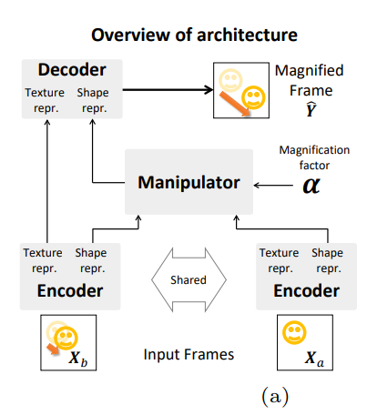

# SSLMotionMagnification

Project exploring various self-supervised methods to generate spatial representations that can be utilized in video motion magnification.

This is a Python3 implementation of 3 Supervised Self Learning algorithms. Namely, MOCOv2, BYOL, and SCRL which are modified in order to work with the downstream task and have the appropriate spatial representations transfered to the Supervised Video Motion Magnifciation as described in [Motion Magnification Paper](https://arxiv.org/pdf/1804.02684.pdf). The self-supervised learning algorithms implementations were based on the implementations introduced in each respective publication but changed accordingly in order to allow for increased augmentations and integration into the codebase

## Dataset

Approximately 200,000 frames were generated in order to train the supervised motion magnificaiton model. The scheme to generate these images involves taking natural images from the COCO data set and using them as background and using segmented objects and placing them randomly in the foreground. Movement was randomined and so was direction. In addition, a magnified frame was generated with spepcific interpolation schemes to prevent blurring and noise. This magnified frame served as the ground truth in the supervised approach in [Oh et al.](https://arxiv.org/pdf/1804.02684.pdf).

For the self-supervised methods 20,000 frames were generated in a similar fashion as described above. Each frame is passed through the ssl networks.

### Model for Fine-tuning


## Hypothesis

Initial attemps tried to generate spatial repersentations through image augmentations which pertained to 

## Generating Data
There are several commands which need to be run in order to run this repo. As well, in order to replicate results training will need to be for different epoch counts according to the model being run. Training time can take anywhere from 6 to 20 hours to train.

1. Clone this repository on a Google VM with access to a Nvidia GPU

2. Ensure that the COCO dataset 2019 Unlabeled dataset has been stored on a gcp cloud bucket. In addition, download the COCO 2019 Object detection tasks with the train, test, and val images. This can be doene via the MSCOCO site or with the [FiftyOne Dataset Zoo](https://voxel51.com/docs/fiftyone/user_guide/dataset_zoo/index.html)

The bucket name will need to be in the bucket variable in the download_images.py file

## Running Models

The models can be run from the following files

In order to train the supervised video motion magnification 

```python magmot_main.py```

In order to train the self-supervised learning algorithms to generate the spatial transformations. The following commands can be run.

```python (byol_main|moco_main|scrl_main).py```

In order to transfer representations and finetune the following command can be run

```python magmot_main.py -transefer true -weights_path {file}```